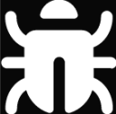

<!--
Hey, thanks for using the awesome-readme-template template.  
If you have any enhancements, then fork this project and create a pull request 
or just open an issue with the label "enhancement".

Don't forget to give this project a star for additional support ;)
Maybe you can mention me or this repo in the acknowledgements too
-->
<div align="center">


  
  <h1>Issue Tracker</h1>
  
  <!-- <p>
    An awesome README template for your projects! 
  </p>
   -->
  
<!-- Badges -->
<p>
  <a href="https://github.com/collinkelly09/Issue-Tracker/graphs/contributors">
    
  </a>
  <a href="">
    
  </a>
  <a href="https://github.com/collinkelly09/Issue-Tracker/forks">
    
  </a>
  <a href="https://github.com/collinkelly09/issue-tracker/issues/">
    
  </a>
 
</p>
   
<!-- <h4>
    <a href="https://github.com/collinkelly09/issue-tracker/">View Demo</a>
  <span> · </span>
    <a href="https://github.com/collinkelly09/issue-tracker">Documentation</a>
  <span> · </span>
    <a href="https://github.com/Louis3797/collinkelly09/issue-tracker/issues/">Report Bug</a>
  <span> · </span>
    <a href="https://github.com/collinkelly09/issue-tracker/issues/">Request Feature</a>
  </h4> -->
</div>

<br />

<!-- Table of Contents -->
# Table of Contents

- [About the Project](#about-the-project)
  * [Screenshots](#screenshots)
  * [Tech Stack](#tech-stack)
  <!-- * [Features](#features) -->
  <!-- * [Color Reference](#color-reference) -->
  * [Environment Variables](#environment-variables)
- [Getting Started](#getting-started)
  * [Prerequisites](#prerequisites)
  <!-- * [Installation](#installation)
  * [Running Tests](#running-tests) -->
  * [Run Locally](#run-locally)
  <!-- * [Deployment](#deployment) -->
- [Contributing](#contributing)
  

<!-- About the Project -->
## About the Project


<!-- Screenshots -->
### Screenshots

<div align="center"> 
  
  <details>
  <summary>more</summary>
  
  
  
</details>
</div>


<!-- TechStack -->
### Tech Stack

<details>
  <summary>Client</summary>
  <ul>
    <li><a href="https://www.typescriptlang.org/">Typescript</a></li>
    <li><a href="https://nextjs.org/">Next.js</a></li>
    <li><a href="https://reactjs.org/">React.js</a></li>
    <li><a href="https://tailwindcss.com/">TailwindCSS</a></li>
    <li><a href="https://www.radix-ui.com/">Radix-UI</a></li>
  </ul>
</details>

<details>
  <summary>Server</summary>
  <ul>
    <li><a href="https://www.typescriptlang.org/">Typescript</a></li>
    <li><a href="https://nextjs.org/">Next.js</a></li>
    <li><a href="https://www.prisma.io/">Prisma</a></li>
  </ul>
</details>

<details>
<summary>Database</summary>
  <ul>
    <li><a href="https://www.mysql.com/">MySQL</a></li>
  </ul>
</details>


<!-- Features -->
### Features

- Create an Issue
    - Users can create new issues by filling in the relevant details (e.g., title, description, priority).
    - Optionally, users can assign a category or tags to help categorize the issue.

- Edit an Issue
    - Users can edit any previously created issue.
    - Changes can be made to the title, description, and other relevant fields.

- View an Issue
    - Users can view the details of an issue, including the title, description, current status, assigned user, and comments.

- Delete an Issue
    - Users have the ability to delete any issue they have created or have permission to manage.
    - Once deleted, the issue will be removed from the system.

- Update the Status of an Issue
    - Users can update the status of an issue (e.g., Open, In Progress, Resolved, Closed).
    - The status helps track the progress and workflow of the issue.

- Assign an Issue to a User
    - Users can assign issues to specific team members or individuals.
    - This helps in ensuring accountability and progress tracking on each issue.

- Comment on an Issue
    - Users can add comments to an issue for collaboration, discussion, or clarification.
    - Comments are stored chronologically and can be edited or deleted by the comment author.

<!-- ! **************************************************** -->

<!-- Color Reference -->
<!-- ### Color Reference

| Color             | Hex                                                                |
| ----------------- | ------------------------------------------------------------------ |
| Primary Color |  #222831 |
| Secondary Color |  #393E46 |
| Accent Color |  #00ADB5 |
| Text Color |  #EEEEEE | -->


<!-- ! **************************************************** -->

<!-- Env Variables -->
### Environment Variables

To run this project, you will need to add the following environment variables to your .env file


`DATABASE_URL`

`NEXTAUTH_URL` provided

`NEXTAUTH_SECRET`

`GITHUB_ID`

`GITHUB_SECRET`

`GOOGLE_CLIENT_ID`

`GOOGLE_CLIENT_SECRET`

Reference the [.env.example](.env.example)

- For `NEXTAUTH_SECRET` open your terminal and execute the following to generate a random string 
    ```bash 
    openssl rand -base64 32
    ```
    
- For `GITHUB_SECRET` and `ID` visit documentation [here](https://next-auth.js.org/providers/github).
- For `GOOGLE_CLIENT_SECRET` and `ID` visit documentation [here](https://next-auth.js.org/providers/google).

<!-- Getting Started -->
## Getting Started

<!-- Prerequisites -->
### Prerequisites

This project uses NPM as package manager

<!-- Run Locally -->
### Run Locally

Clone the project

```bash
  git clone https://github.com/collinkelly09/issue-tracker.git
```

Go to the project directory

```bash
  cd issue-tracker
```

Install dependencies

```bash
  npm install
  npx prisma migrate dev
```

Start the server

```bash
  npm run dev
```

<!-- Contact -->
## Contact

Collin Kelly - [LinkedIn](https://www.linkedin.com/in/collinkelly09/) - collinkelly09@gmail.com

Project Link: [https://github.com/collinkelly09/issue-tracker](https://github.com/collinkelly09/issue-tracker)
